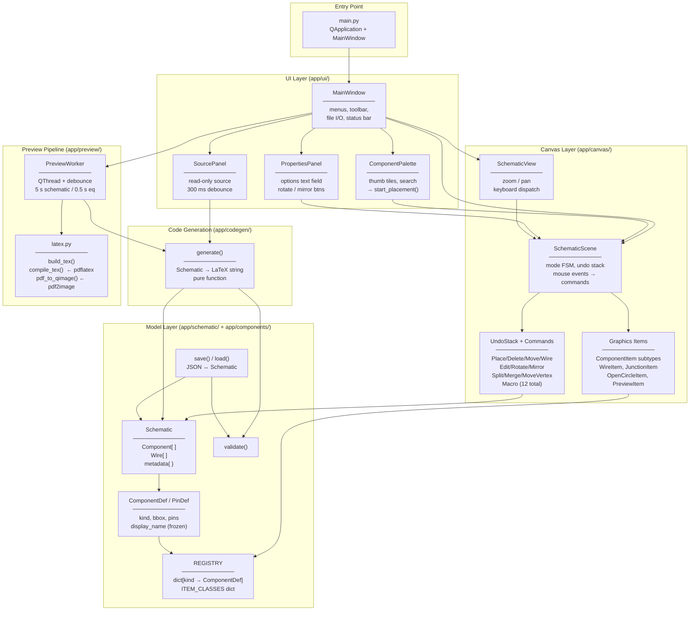
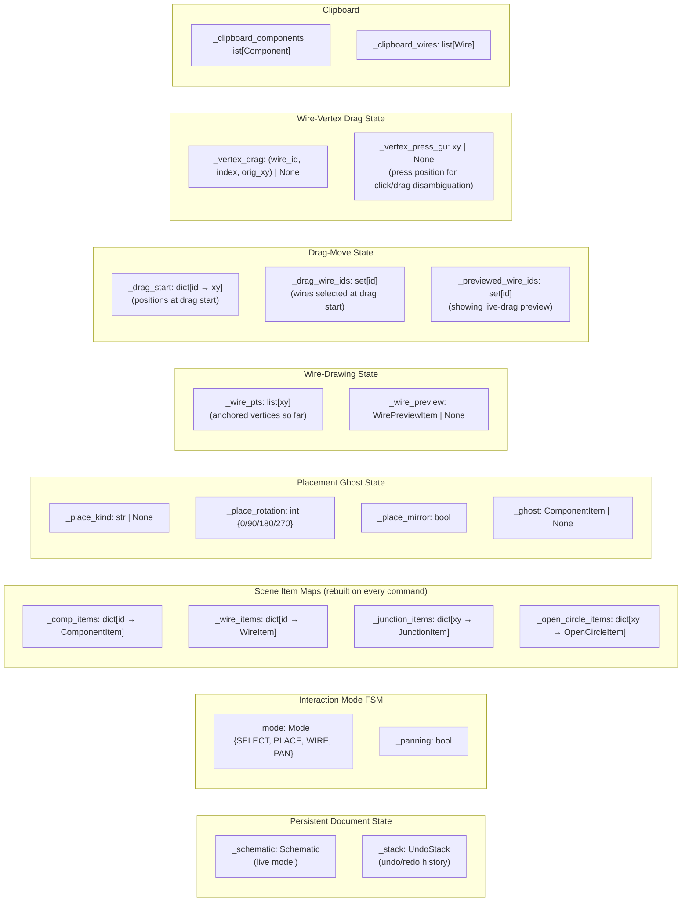
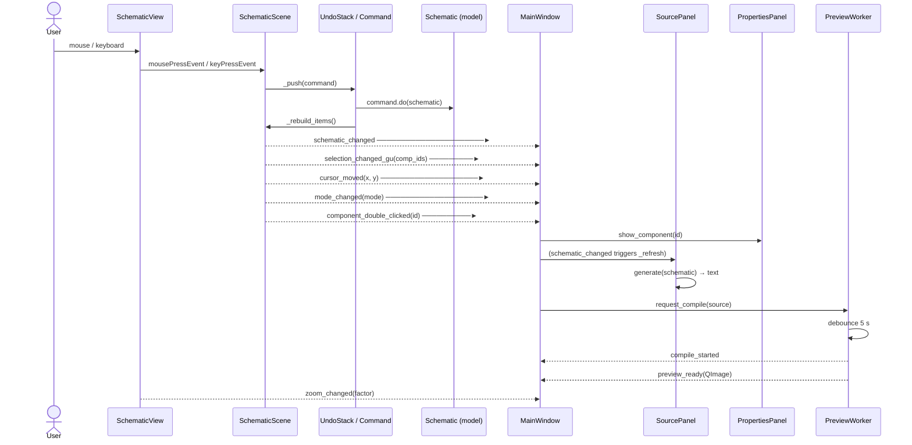
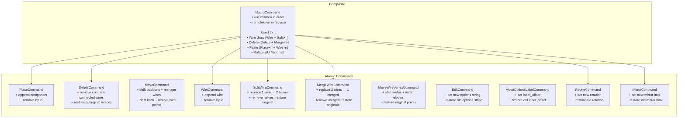
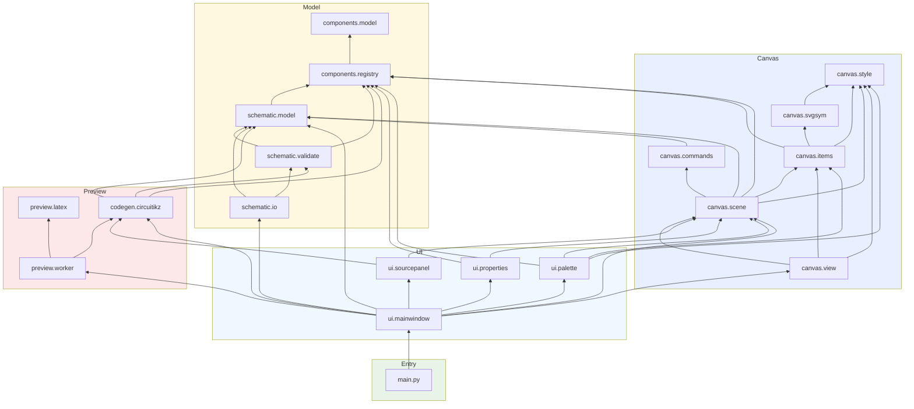

# Heaviside — Software Architecture

## Layer Overview

---

## SchematicScene — State Variables

---

## Signals & Data Flow

---

## Command Taxonomy & Inverses

---

## Module Dependency Graph

