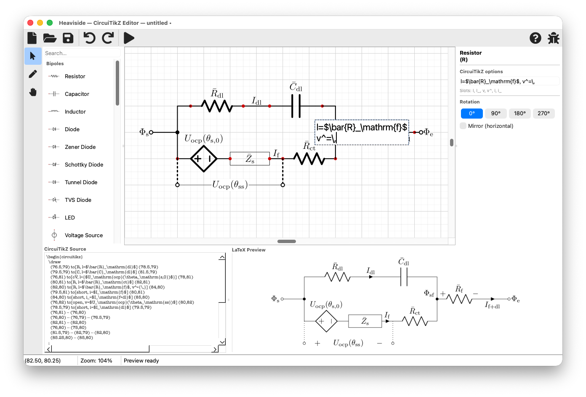

# Heaviside

[](https://github.com/whileman133/Heaviside/actions/workflows/ci.yml)
[](https://github.com/whileman133/Heaviside/releases)
[](LICENSE)

An opinionated [WYSIWYM](https://en.wikipedia.org/wiki/WYSIWYM) editor for producing publication-quality circuit diagrams using [CircuiTikZ](https://github.com/circuitikz/circuitikz) LaTeX.
It is designed for researchers, engineers, and educators who author schematics with typeset mathematical annotations.


## Features

**Schematic entry**

- Grid-disciplined, fixed-component-size canvas with quarter-grid snapping
- A library of two-terminal parts (resistors, capacitors, inductors, diodes, sources), multi-terminal parts (op amps, MOSFETs, BJTs), grounds, and supply rails
- Block-diagram primitives — labelled boxes, circles, and free text — with wires connecting anywhere on a shape's perimeter
- 90° rotation, mirroring, resizing, copy/paste, and full undo/redo

**Typeset math, WYSIWYM**

- Component and wire labels are written as LaTeX fragments and shown **typeset directly on the canvas**, on their conventional sides — what you see is what the figure means
- Wire endpoint, mid-wire, and component annotations (labels, voltages, currents)

**Wiring**

- Manhattan-routed wires with automatic junction dots derived from connectivity
- Line hops at non-connecting crossings; per-wire line styles, widths, and endpoint markers/arrowheads

**Output**

- Clean, human-readable CircuiTikZ source as the primary output, plus PDF and EPS export
- Live, rendered PDF preview of the current schematic
- Lossless save/load via a JSON `.hv` file format

Component and wire labels are written as LaTeX and rendered as typeset math on the
canvas, so equations read the way they will in the final figure:



> **Built spec-first with AI assistance.** Heaviside was developed from a
> detailed written specification with substantial help from AI coding assistants.
> The implementation follows the spec, the test suite (660+ tests) and spec are
> kept in sync, and the full methodology is documented in
> [`docs/ai-development.md`](docs/ai-development.md). See
> [`CONTRIBUTING.md`](CONTRIBUTING.md) for more.

## Requirements

- Python ≥ 3.11
- [`uv`](https://docs.astral.sh/uv/) for environment and dependency management
- `pdflatex` on your `PATH`, with the `circuitikz` package installed (TeX Live or
  MiKTeX) — used for the rendered preview
- *(optional)* [Poppler](https://poppler.freedesktop.org/) (`pdftocairo`) — only
  needed for **EPS export**. The preview is rendered by Qt's own PDF engine, so
  Poppler is not required for normal use.

Python dependencies (PySide6, pydantic, qtawesome) are declared in
[`pyproject.toml`](pyproject.toml) and installed by `uv`. The PDF preview uses
the `QtPdf` module that ships with PySide6 — no extra Python packages.

## Running

```sh
uv run heaviside        # or: uv run python main.py
```

## Tests

```sh
uv run pytest                 # full suite with coverage
uv run pytest --no-cov        # faster, no coverage
QT_QPA_PLATFORM=offscreen uv run pytest   # headless (CI / no display)
```

## Packaging a standalone app

Build a self-contained app with [PyInstaller](https://pyinstaller.org) (no
Python install required to run the result):

```sh
./scripts/build_app.sh        # or: uv run pyinstaller --noconfirm --clean heaviside.spec
```

Output:

- **macOS** → `dist/Heaviside.app` (drag to `/Applications`)
- **Windows / Linux** → `dist/Heaviside/` (run the `Heaviside` executable inside)

The bundle includes everything the app needs **except** `pdflatex` (TeX Live /
MiKTeX, with `circuitikz`), which the preview and exports compile with — bundling
a full TeX distribution is impractical, so it stays a user-installed dependency
and the app warns at startup if it is missing. (EPS export additionally needs
Poppler's `pdftocairo`, checked only when you actually export EPS.) Editing,
source generation, preview, and PDF/`.tex` export need only `pdflatex`. Build
configuration lives in [`heaviside.spec`](heaviside.spec).

### Opening the app on macOS (first launch)

The distributed `Heaviside.app` is **not signed with an Apple Developer ID or
notarized** (Heaviside is a free, open-source project). macOS Gatekeeper will
therefore block it on first launch — typically with *“Heaviside” is damaged and
can’t be opened* or *cannot be opened because Apple cannot check it for malicious
software*. **The app is not damaged**; this is just how macOS treats
downloaded apps without a paid Developer ID signature.

To open it the first time, do **one** of the following:

- **Right-click (or Control-click) the app → Open**, then confirm in the dialog.
  After the first time it opens normally. *(On recent macOS this option may be
  hidden; use the Terminal method below if so.)*
- **Or** clear the download quarantine from Terminal, then open it:

  ```sh
  xattr -dr com.apple.quarantine /Applications/Heaviside.app
  open /Applications/Heaviside.app
  ```

Windows builds may likewise show a SmartScreen “unknown publisher” prompt; choose
**More info → Run anyway**. Linux builds run directly.

## Documentation

- [`PROJECT_SPEC.md`](PROJECT_SPEC.md) — the authoritative, living specification.
  Any behavioral change must keep this in sync (see its §0).
- [`ARCHITECTURE.md`](ARCHITECTURE.md) — module layout and design overview.
- [`CLAUDE.md`](CLAUDE.md) — instructions for AI agents working in this repo.

## Project layout

```
app/
  canvas/      # QGraphicsScene/View, items, undo commands, SVG symbol rendering
  codegen/     # Schematic → CircuiTikZ source
  components/  # Component model + registry of component kinds
  preview/     # pdflatex compile worker and LaTeX templating
  schematic/   # data model, JSON I/O, validation
  ui/          # main window, palette, properties, source panel
main.py        # entry point
tools/         # build-time tooling (CircuiTikZ SVG export + manifest)
tests/         # pytest suite
```

## Contributing

Contributions are welcome — see [`CONTRIBUTING.md`](CONTRIBUTING.md) for the
development setup, the test/spec sync rule, and how this codebase was built.

## License

Heaviside is released under the [MIT License](LICENSE).

Its GUI toolkit, **PySide6 (Qt for Python), is licensed under the LGPL v3**.
Using PySide6 as an ordinary dependency (the `uv run` workflow above) imposes no
extra obligations on you. The other Python dependencies (`pydantic`, `qtawesome`)
are MIT-licensed and impose no such requirement.

### Redistributing the standalone app (LGPL compliance)

If you **redistribute the bundled `.app` / `.exe`** built with PyInstaller, the
LGPLv3 attaches obligations to that binary for the bundled Qt/PySide6. They are
satisfied out of the box by the files in [`licenses/`](licenses/), which the
build bundles **inside** the distributable (see `heaviside.spec`):

- **Notice + license text** — `licenses/THIRD_PARTY_LICENSES.md` plus
  `LGPL-3.0.txt` (and `GPL-3.0.txt`, fetched at build time) ship inside the
  `.app` / `Heaviside/` folder.
- **Corresponding source** — the notice links to the exact PySide6/Qt source
  releases bundled.
- **Relinking** — the build is a *directory* bundle (`.app` / onedir), so the Qt
  libraries are separate, user-replaceable files; do **not** switch to a
  PyInstaller *onefile* build, which would defeat this.

This keeps Heaviside itself fully MIT — the LGPL touches only the bundled Qt
portion, and you are not required to open any of your own code. See
`licenses/THIRD_PARTY_LICENSES.md` for the full details.
