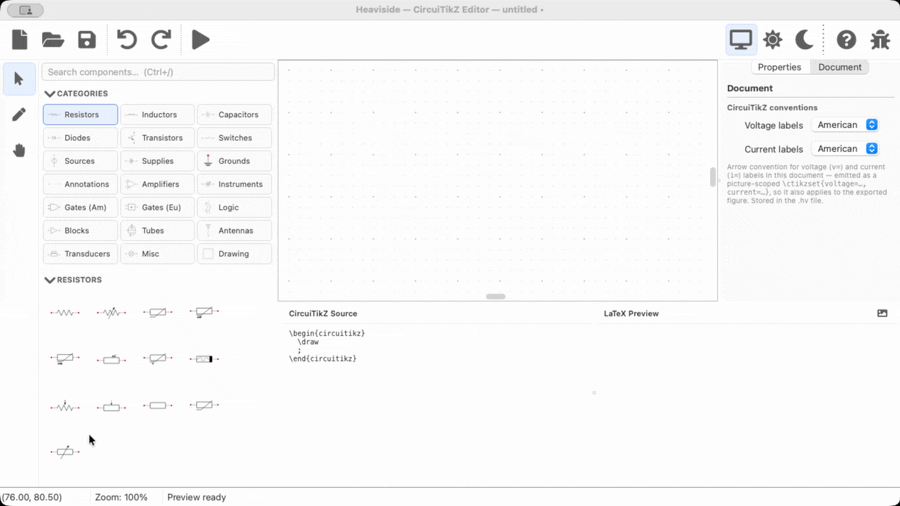
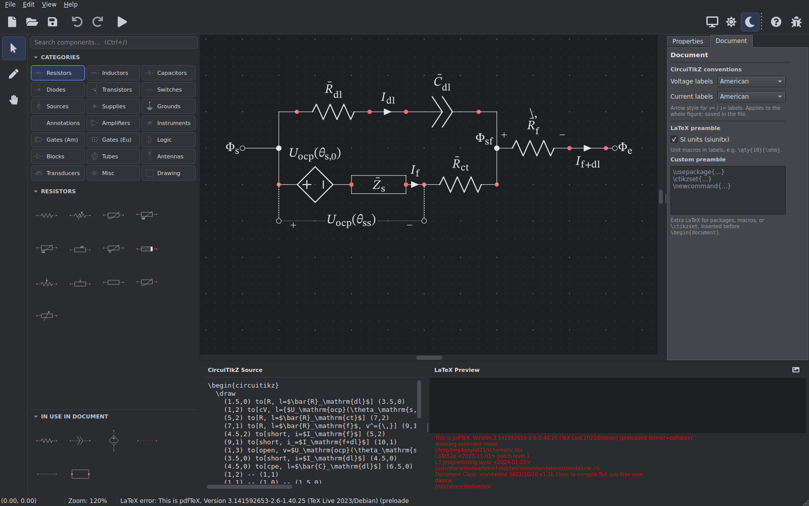
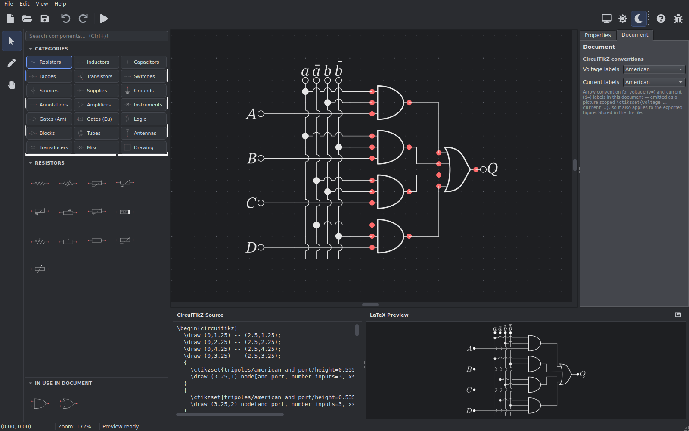
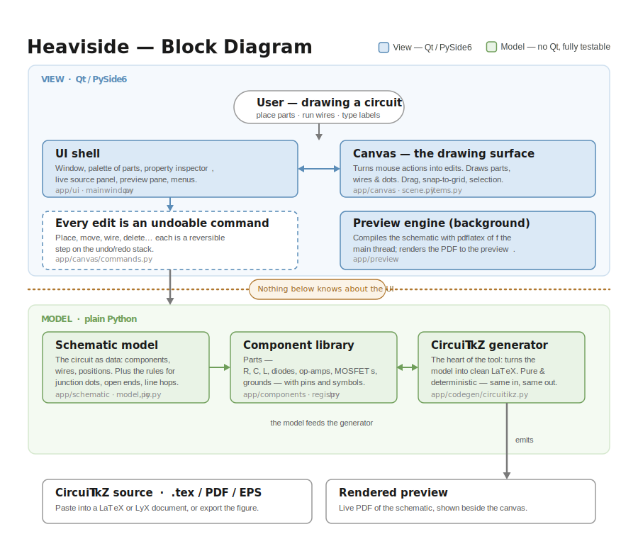

<p align="center">
  
</p>

# Heaviside

[](https://github.com/whileman133/Heaviside/actions/workflows/ci.yml)
[](https://github.com/whileman133/Heaviside/releases)
[](LICENSE)

An opinionated [WYSIWYM](https://en.wikipedia.org/wiki/WYSIWYM) editor for building publication-quality circuit diagrams with typeset mathematical annotations using [CircuiTikZ](https://github.com/circuitikz/circuitikz). Heaviside is a desktop tool for researchers, educators, and engineers that integrates into LaTeX, Overleaf, and LyX workflows with minimum effort.

> **Heaviside is a work in progress.** If symbols, CircuiTikZ output, or workflow details you need are missing, I'd love to hear about it. Open a [Discussion](https://github.com/whileman133/Heaviside/discussions) for ideas and questions, or [file an issue](https://github.com/whileman133/Heaviside/issues/new) for bugs.

<table>
  <tr>
    <td align="center" colspan="2">
    <br>
      <sub><b>Live editing</b> · draw, wire, and label while the CircuiTikZ source and compiled preview update</sub>
    </td>
  </tr>
  <tr>
    <td align="center" width="50%">
      <br>
      <sub><b>Porous Electrode Interface</b> · dark mode</sub>
    </td>
    <td align="center" width="50%">
      <br>
      <sub><b>4:1 MUX</b> · dark mode</sub>
    </td>
  </tr>
</table>

## Features

* **Grid-aligned CircuiTikZ.** Draw on a grid-snapped canvas and get clean, publication-ready CircuiTikZ source with a compiled PDF preview as you work.
* **Typeset math.** Component and wire labels are LaTeX (`$R_1$`, `$v(t)$`), rendered on the canvas as they'll appear in print.
* **Smart wiring.** Right-angle routing with automatic junction dots, open-terminal markers, and line hops at crossings.
* **Symbols and blocks.** Passives, sources, semiconductors, op-amps, and configurable logic gates, plus boxes, circles, and free text for block diagrams.
* **Exports that stay current.** Every save refreshes `.tex`, `.pdf`, and `.png` siblings alongside your schematic so your paper's figures never go stale.

## Why another CircuiTikZ editor?

An excellent tool for drawing CircuiTikZ already exists:
[CircuiTikZ Designer](https://circuit2tikz.tf.fau.de/designer/), a browser app
that's great for sketching circuits and copying out the code quickly. Heaviside solves a different problem: **maintaining circuit figures over the life of a project**, where diagrams are documents you keep and revise over years.

* **A source file, not a one-off drawing.** Schematics live in versioned `.hv` files alongside your manuscript, and every save refreshes the co-located figures — so what's in your paper never drifts from what's in the editor.
* **True CircuiTikZ, not an imitation.** Heaviside doesn't imitate CircuiTikZ to draw a preview—the preview shows the true output compiled with `pdflatex`. The palette symbols are extracted from compiled CircuiTikZ, with pin positions measured from pgf anchors rather than traced by hand, and canvas labels are typeset by your local `latex` when it's installed.
* **A desktop app, offline.** Native file associations, your local TeX installation, and no dependency on a server staying up.

If you want a quick diagram in the browser with nothing to install, use Designer. If your circuits are part of a LaTeX/Overleaf/LyX writing workflow, Heaviside is built for you.

## Download

> **The core editor runs and produces CircuiTikZ without a LaTeX installation,** but live preview and PDF/PNG export require `pdflatex` with the `circuitikz` package. For EPS/SVG export, 
> [Poppler](https://poppler.freedesktop.org/)'s `pdftocairo` or
> [Inkscape](https://inkscape.org/) is required.

- **macOS**  
    Apple Silicon: [Heaviside-macos-arm64.dmg](https://github.com/whileman133/Heaviside/releases/latest/download/Heaviside-macos-arm64.dmg)  
    Intel: [build from source](#building-from-source)
- **Windows (x64)**  
    Installer: [Heaviside-windows-x64-setup.exe](https://github.com/whileman133/Heaviside/releases/latest/download/Heaviside-windows-x64-setup.exe)   
    Portable: [Heaviside-windows-x64.zip](https://github.com/whileman133/Heaviside/releases/latest/download/Heaviside-windows-x64.zip)  
    *Not yet code-signed — on first run Windows SmartScreen shows a warning; click **More info → Run anyway**.*
- **Linux (x64)**  
    AppImage: [Heaviside-linux-x86_64.AppImage](https://github.com/whileman133/Heaviside/releases/latest/download/Heaviside-linux-x86_64.AppImage)  
    Portable: [Heaviside-linux-x64.tar.gz](https://github.com/whileman133/Heaviside/releases/latest/download/Heaviside-linux-x64.tar.gz)
- **Linux (arm64 — Raspberry Pi OS 64-bit, etc.)**  
    AppImage: [Heaviside-linux-aarch64.AppImage](https://github.com/whileman133/Heaviside/releases/latest/download/Heaviside-linux-aarch64.AppImage)  
    Portable: [Heaviside-linux-arm64.tar.gz](https://github.com/whileman133/Heaviside/releases/latest/download/Heaviside-linux-arm64.tar.gz)

  The Linux binaries need glibc ≥ 2.38 (Ubuntu 24.04+, Debian 13 "Trixie" —
  including Raspberry Pi OS Trixie). On older distros (e.g. Debian 12
  "Bookworm"), [build from source](#building-from-source) instead. Make an
  AppImage executable before running it: `chmod +x Heaviside-*.AppImage`.

All releases, with checksums and notes, on the [Releases page](https://github.com/whileman133/Heaviside/releases).

## Getting started

1. **Launch Heaviside.** You're greeted by a welcome screen. Start a blank
   schematic with **File → New**, or explore a ready-made one via
   **File → Open Example ▸** (these ship with the app).
2. **Place components.** Drag symbols from the component palette on the left onto
   the canvas. They snap to the CircuiTikZ grid so everything stays aligned.
3. **Wire them up.** Drag from one component terminal to another; wires route at
   right angles and drop junction dots automatically.
4. **Label and style.** Select a component or wire to edit its labels (typeset
   math, e.g. `$R_1$`), value, orientation, and style in the properties panel.
5. **Watch the source and preview.** The CircuiTikZ source and a live compiled
   PDF preview update as you work. Press **Ctrl/Cmd+Return** to force a recompile.
6. **File → Save** writes the `.hv` source and, on
   every save, automatically refreshes the co-located `.tex`, `.pdf`, and `.png`
   exports so your paper's figures stay current (add `.svg`/`.eps` siblings in
   **Preferences → Export**). You can also export on demand from the
   **File → Export** menu (`.tex`, `.pdf`, `.svg`, `.eps`, `.png`).

## Building from source

Heaviside uses [`uv`](https://docs.astral.sh/uv/) and targets **Python ≥ 3.12**. Python dependencies (PySide6, pydantic, qtawesome) are declared in
[`pyproject.toml`](pyproject.toml) and installed by `uv`. (As when running a downloaded build, the preview and exports need `pdflatex` on your `PATH`, and EPS/SVG export additionally needs Poppler — see [Download](#download).)

```sh
uv run heaviside              # run from source

uv run pytest                 # full test suite with coverage
QT_QPA_PLATFORM=offscreen uv run pytest   # headless (CI / no display)
```

### Packaging a standalone app

Build a self-contained bundle with [PyInstaller](https://pyinstaller.org):

```sh
uv run python scripts/build.py    # or: uv run pyinstaller --noconfirm --clean heaviside.spec
```

`build.py` is cross-platform (macOS, Windows, Linux): it regenerates the app
icons from `assets/icon.png`, ensures the bundled license texts are present, and
runs PyInstaller. Output is `dist/Heaviside.app` on macOS and `dist/Heaviside/`
elsewhere. Build configuration lives in [`heaviside.spec`](heaviside.spec).

### Regenerating the component library (after a CircuiTikZ update)

The palette symbols and their pin positions aren't hand-drawn — they're
extracted from compiled CircuiTikZ output (`latex` + `dvisvgm`), with anchors
measured via pgf's `\pgfpointanchor` (see
[`app/components/render.py`](app/components/render.py)). When a new CircuiTikZ
release moves or redraws symbols, re-render the shipped library with the
**single sanctioned script**:

```sh
python components/generate_components.py   # needs latex + dvisvgm (+ Ghostscript for filled symbols)
uv run pytest                              # the suite guards the regenerated data files
```

It treats `components/definitions.json` as the source of truth and rewrites it
plus `components/geometry.json`, re-measuring each multi-terminal symbol's
anchors so grid alignment reflows automatically, and stamps the file with the
CircuiTikZ version it rendered against (`circuitikz_version`).

## Documentation

- [`PROJECT_SPEC.md`](PROJECT_SPEC.md) — the authoritative, living specification.
  Any behavioral change must keep this in sync (see its §0).
- [`CLAUDE.md`](CLAUDE.md) — instructions for AI agents working in this repo.

## Contributing

Contributions are welcome — see [`CONTRIBUTING.md`](CONTRIBUTING.md) for the
development setup, the test/spec sync rule, and how this codebase was built.

## License

Heaviside is released under the [MIT License](LICENSE).

Its GUI toolkit, **PySide6 (Qt for Python), is licensed under the LGPL v3**.
Using PySide6 as an ordinary dependency (the `uv run` workflow above) imposes no
extra obligations on you. The other Python dependencies (`pydantic`, `qtawesome`)
are MIT-licensed and impose no requirements.

### Redistributing the standalone app (LGPL compliance)

If you **redistribute the bundled `.app` / `.exe`** built with PyInstaller, the
LGPLv3 attaches obligations to that binary for the bundled Qt/PySide6. They are
satisfied out of the box by the files in [`licenses/`](licenses/), which the
build bundles **inside** the distributable (see `heaviside.spec`):

- **Notice + license text** — `licenses/THIRD_PARTY_LICENSES.md` plus
  `LGPL-3.0.txt` (and `GPL-3.0.txt`, fetched at build time) ship inside the
  `.app` / `Heaviside/` folder.
- **Corresponding source** — the notice links to the exact PySide6/Qt source
  releases bundled.
- **Relinking** — the build is a *directory* bundle (`.app` / onedir), so the Qt
  libraries are separate, user-replaceable files; do **not** switch to a
  PyInstaller *onefile* build, which would defeat this.

This keeps Heaviside itself fully MIT — the LGPL touches only the bundled Qt
portion, and you are not required to open any of your own code. See
`licenses/THIRD_PARTY_LICENSES.md` for the full details.


## Architecture

> **Built spec-first with AI assistance.** Heaviside was developed from a detailed written specification with help from Large-Language Models (LLMs). The test suite (1200+ tests) and spec are kept in sync.

Heaviside is split into a **View** layer built on Qt and a
**Model** layer of plain Python. The model, comprising the schematic data, the component library, and the CircuiTikZ generator, holds the logic and is testable without a display. The UI and canvas sit on top of the model.



```
app/
  canvas/      # QGraphicsScene/View, items, undo commands, SVG symbol rendering
  codegen/     # Schematic → CircuiTikZ source
  components/  # Component model + registry of component kinds
  preview/     # pdflatex compile worker and LaTeX templating
  schematic/   # data model, JSON I/O, validation
  ui/          # main window, palette, properties, source panel
main.py        # entry point
components/     # Generated symbol data (geometry.json, definitions.json) + generator
tests/         # pytest suite
```
