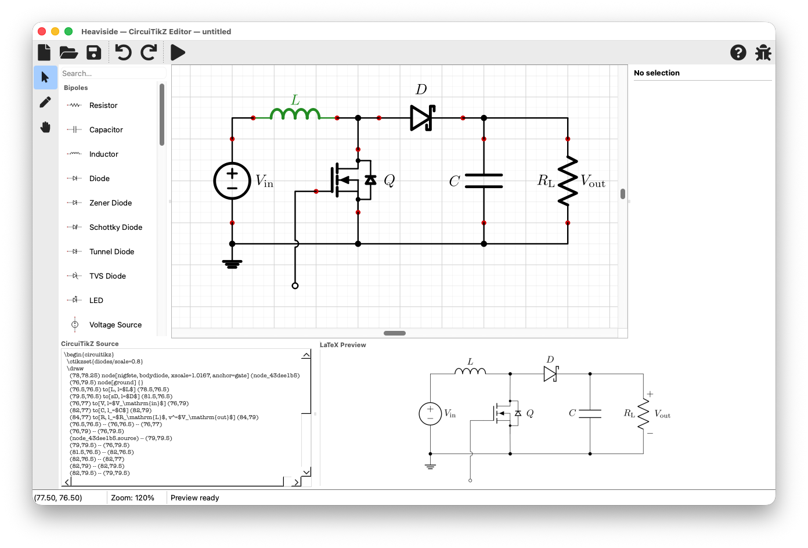
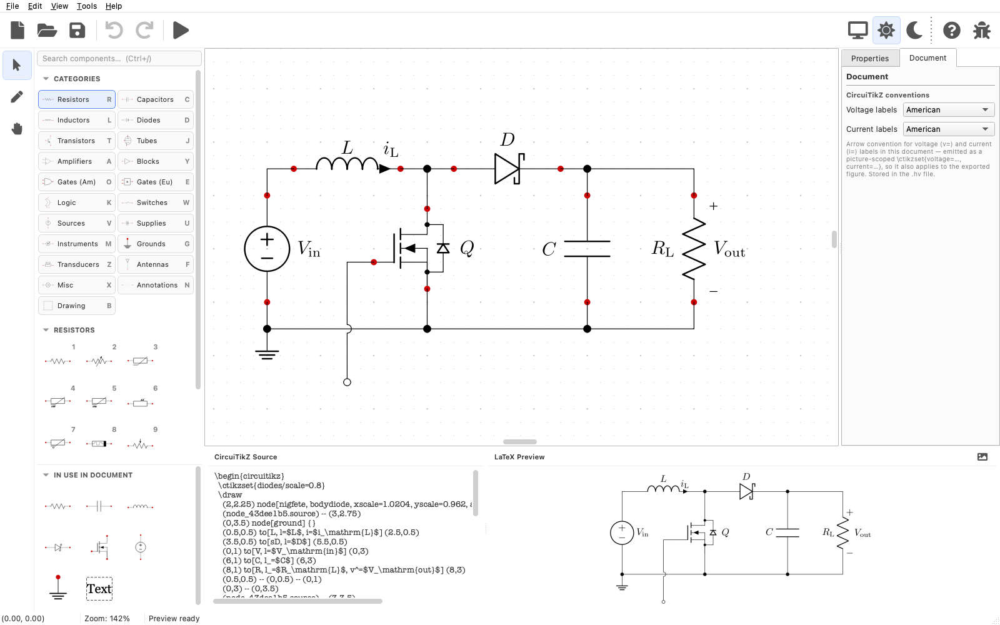
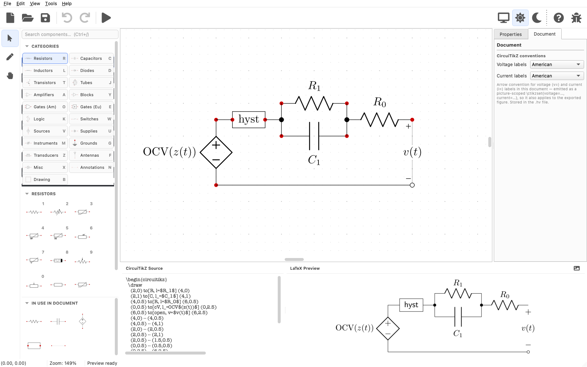

<p align="center">
  
</p>

# Heaviside

[](https://github.com/whileman133/Heaviside/actions/workflows/ci.yml)
[](https://github.com/whileman133/Heaviside/releases)
[](LICENSE)

An opinionated [WYSIWYM](https://en.wikipedia.org/wiki/WYSIWYM) editor for building publication-quality circuit diagrams with typeset mathematical annotations. It's a streamlined desktop tool designed for researchers, educators, and engineers, integrating into LyX, Overleaf, and LaTeX workflows with minimum effort.



## Features

### Intelligent Canvas
* **Grid-Disciplined Editing:** Quarter-grid CircuiTikZ snapping guarantees your components and wires line up.
* **Smart Wiring:** Automatic junction dots at connections, optional open-terminal dots at loose ends, and optional line hops at wire crossings.
* **Smart Routing:** Wires route at right angles, with customizable line style, weight, endpoint arrowheads, and typeset endpoint and mid-point labels.
* **Transformations:** 90° rotation, horizontal mirroring, shape resizing, copy/paste, and undo/redo.
* **Live PDF Preview:** Displays a real-time, compiled PDF rendering of your schematic directly inside the editor as you work.

### Component & Block Libraries
* **Schematic Symbols:** Built-in library with standard two-terminal parts (resistors, capacitors, inductors, diodes, sources), multi-terminal semiconductors (op-amps, MOSFETs, BJTs), logic gates with a configurable number of inputs, grounds, and power supply rails.
* **Block-Diagram Primitives:** Build system diagrams using boxes, circles, and free text, with wires that snap dynamically to any point on a shape's perimeter.

### Export Pipeline
* **Automatic Export:** Every save updates the Heaviside schematic (`.hv`), CircuiTikZ code (`.tex`), and compiled vector graphics (`.pdf`, `.svg`, or `.eps`) on the filesystem. Your paper's figures stay up to date without manual exports.

> **Built spec-first with AI assistance.** Heaviside was developed from a detailed written specification with help from AI coding assistants. The test suite (700+ tests) and spec are kept in sync.

## Gallery

Four of the bundled examples (`examples/`) open in the full editor — palette, canvas, inspector, and live CircuiTikZ source/PDF preview — in light and dark mode. The release pipeline re-captures these automatically, so they always match the latest release.

<table>
  <tr>
    <td align="center" width="50%">
      <br>
      <sub><b>Boost Converter</b> · Power Electronics · light mode</sub>
    </td>
    <td align="center" width="50%">
      <br>
      <sub><b>4:1 MUX</b> · Logic Circuits · dark mode</sub>
    </td>
  </tr>
  <tr>
    <td align="center" width="50%">
      <br>
      <sub><b>ESC Cell Model</b> · Battery Models · light mode</sub>
    </td>
    <td align="center" width="50%">
      <br>
      <sub><b>Porous Electrode Interface</b> · Battery Models · dark mode</sub>
    </td>
  </tr>
</table>

## Download

Pre-built apps (always the latest release):

- **macOS (Apple Silicon)** → [Heaviside-macos-arm64.dmg](https://github.com/whileman133/Heaviside/releases/latest/download/Heaviside-macos-arm64.dmg)
- **Windows (x64)** → [Heaviside-windows-x64-setup.exe](https://github.com/whileman133/Heaviside/releases/latest/download/Heaviside-windows-x64-setup.exe) (installer) · [Heaviside-windows-x64.zip](https://github.com/whileman133/Heaviside/releases/latest/download/Heaviside-windows-x64.zip) (portable)
- **Linux (x64)** → [Heaviside-linux-x86_64.AppImage](https://github.com/whileman133/Heaviside/releases/latest/download/Heaviside-linux-x86_64.AppImage) (run anywhere) · [Heaviside-linux-x64.tar.gz](https://github.com/whileman133/Heaviside/releases/latest/download/Heaviside-linux-x64.tar.gz) (portable)

Or browse all releases (with checksums and release notes) on the
[Releases page](https://github.com/whileman133/Heaviside/releases).

> **The macOS build is Apple Silicon (arm64) only.** It will not run on an
> Intel Mac. Intel users can run Heaviside by [building from source](#packaging-a-standalone-app)
> (`scripts/build.py` produces a native Intel `.app` on an Intel Mac).

> **Works without LaTeX — for the most part.** Drawing, on-canvas typeset
> equation labels (rendered by a bundled, pure-Python engine), CircuiTikZ source
> generation, and `.tex` export all work with **no LaTeX installation**.
>
> **Needs `pdflatex` (with the `circuitikz` package) on your `PATH`:** the live
> **PDF preview pane** and the **PDF / EPS / SVG image exports** — these compile
> the schematic with LaTeX. The app warns at startup if it can't find `pdflatex`.
> When LaTeX *is* installed, the canvas labels use it for the highest fidelity.
> If a tool isn't on your `PATH` (or you want a specific install), set its path
> in **Preferences → Tools**.
>
> **Optional: Poppler (for EPS and SVG export).** Exporting to **EPS** or **SVG**
> additionally needs `pdftocairo` from [Poppler](https://poppler.freedesktop.org/).
> PDF export needs only `pdflatex`, so you can skip Poppler unless you export EPS
> or SVG.

> **Installing:** On **macOS**, open the `.dmg` and drag **Heaviside** onto the
> **Applications** folder. On **Windows**, run **`Heaviside-windows-x64-setup.exe`**
> — it installs Heaviside (no admin needed), adds a Start Menu shortcut, and
> associates `.hv` files so you can double-click a schematic to open it; an
> uninstaller is added to *Add or remove programs*. (Prefer no install? The
> `.zip` is portable — unzip and run `Heaviside.exe`.) On **Linux**, download the
> **`.AppImage`**, make it executable (`chmod +x Heaviside-linux-x86_64.AppImage`)
> and run it — no install, no root. (Prefer the folder form? The `.tar.gz` is
> portable — `tar -xzf Heaviside-linux-x64.tar.gz` and run the `Heaviside`
> executable inside.) The AppImage needs FUSE; on systems without it, run it with
> `./Heaviside-linux-x86_64.AppImage --appimage-extract-and-run`.
>
> **First launch:** if these builds are not code-signed/notarized, macOS and
> Windows will warn on first open — see
> [Opening the app with macOS](#opening-the-app-with-macos) for how to proceed.

> **Stay up to date.** Heaviside checks GitHub for a newer release on startup and
> tells you if one is available (it never downloads or installs anything by
> itself, and sends no information about you). Turn it off in
> **Preferences → Updates**, or check on demand from **Help → Check for Updates**.

## Getting started

1. **Launch Heaviside.** You're greeted by a welcome screen. Start a blank
   schematic with **File → New**, or explore a ready-made one via
   **File → Open Example ▸** (these ship with the app).
2. **Place components.** Drag symbols from the component palette on the left onto
   the canvas. They snap to the CircuiTikZ grid so everything stays aligned.
3. **Wire them up.** Drag from one component terminal to another; wires route at
   right angles and drop junction dots automatically.
4. **Label and style.** Select a component or wire to edit its labels (typeset
   math, e.g. `$R_1$`), value, orientation, and style in the properties panel.
5. **Watch the source and preview.** The CircuiTikZ source and a live compiled
   PDF preview update as you work. Press **Ctrl/Cmd+Return** to force a recompile.
6. **Save once, export forever.** **File → Save** writes the `.hv` source and, on
   every save, automatically refreshes the co-located `.tex` and image exports so
   your paper's figures stay current. You can also export on demand from the
   **File → Export** menu (`.tex`, `.pdf`, `.svg`, `.eps`, `.png`).

> **No LaTeX? Most of this still works.** Drawing, typeset on-canvas labels,
> CircuiTikZ source, and `.tex` export need no LaTeX install. The live **PDF
> preview** and **PDF/EPS/SVG** image exports need `pdflatex` (and Poppler for
> EPS/SVG) — see the [Download](#download) notes above. Point Heaviside at a
> specific install under **Preferences → Tools** if a tool isn't on your `PATH`.

## Opening the app with macOS

Open the downloaded `.dmg` and drag **Heaviside** onto the **Applications**
folder, then launch it from Applications.

When the release is **signed and notarized** with an Apple Developer ID, it
opens normally — you can skip the rest of this section.

If a build is **not** notarized (e.g. a fork, or before signing is configured),
macOS Gatekeeper blocks it on first launch with a message like *“Apple could not
verify ‘Heaviside.app’ is free of malware…”*. This does **not** indicate a
problem with the app — it is how macOS treats software that hasn’t been notarized
through a paid Developer ID. To open it the first time, do **one** of the
following:

- **System Settings → Privacy & Security:** try to open the app once (and dismiss
  the warning), then open **System Settings → Privacy & Security**, scroll to the
  **Security** section near the bottom, and click **“Open Anyway”** next to the
  note about Heaviside. Confirm in the dialog. After this, it opens normally.
- **Or** clear the download quarantine from Terminal, then open it:

  ```sh
  xattr -dr com.apple.quarantine /Applications/Heaviside.app
  open /Applications/Heaviside.app
  ```

## Architecture

Heaviside is split into a **View** layer built on Qt and a
**Model** layer of plain Python. The model, comprising the schematic data, the component library, and the CircuiTikZ generator, holds the logic and is testable without a display. The UI and canvas sit on top of the model.


```
app/
  canvas/      # QGraphicsScene/View, items, undo commands, SVG symbol rendering
  codegen/     # Schematic → CircuiTikZ source
  components/  # Component model + registry of component kinds
  preview/     # pdflatex compile worker and LaTeX templating
  schematic/   # data model, JSON I/O, validation
  ui/          # main window, palette, properties, source panel
main.py        # entry point
components/     # Generated symbol data (geometry.json, definitions.json) + generator
tests/         # pytest suite
```

## Building from source

Heaviside uses [`uv`](https://docs.astral.sh/uv/) and targets **Python ≥ 3.11**. Python dependencies (PySide6, pydantic, qtawesome) are declared in
[`pyproject.toml`](pyproject.toml) and installed by `uv`. (As when running a downloaded build, the preview and exports need `pdflatex` on your `PATH`, and EPS/SVG export additionally needs Poppler — see [Download](#download).)

```sh
uv run heaviside              # run from source

uv run pytest                 # full test suite with coverage
QT_QPA_PLATFORM=offscreen uv run pytest   # headless (CI / no display)
```

### Packaging a standalone app

Build a self-contained bundle with [PyInstaller](https://pyinstaller.org):

```sh
uv run python scripts/build.py    # or: uv run pyinstaller --noconfirm --clean heaviside.spec
```

`build.py` is cross-platform (macOS, Windows, Linux): it regenerates the app
icons from `assets/icon.png`, ensures the bundled license texts are present, and
runs PyInstaller. Output is `dist/Heaviside.app` on macOS and `dist/Heaviside/`
elsewhere. Build configuration lives in [`heaviside.spec`](heaviside.spec).

## Documentation

- [`PROJECT_SPEC.md`](PROJECT_SPEC.md) — the authoritative, living specification.
  Any behavioral change must keep this in sync (see its §0).
- [`CLAUDE.md`](CLAUDE.md) — instructions for AI agents working in this repo.

## Contributing

Contributions are welcome — see [`CONTRIBUTING.md`](CONTRIBUTING.md) for the
development setup, the test/spec sync rule, and how this codebase was built.

## License

Heaviside is released under the [MIT License](LICENSE).

Its GUI toolkit, **PySide6 (Qt for Python), is licensed under the LGPL v3**.
Using PySide6 as an ordinary dependency (the `uv run` workflow above) imposes no
extra obligations on you. The other Python dependencies (`pydantic`, `qtawesome`)
are MIT-licensed and impose no such requirement.

### Redistributing the standalone app (LGPL compliance)

If you **redistribute the bundled `.app` / `.exe`** built with PyInstaller, the
LGPLv3 attaches obligations to that binary for the bundled Qt/PySide6. They are
satisfied out of the box by the files in [`licenses/`](licenses/), which the
build bundles **inside** the distributable (see `heaviside.spec`):

- **Notice + license text** — `licenses/THIRD_PARTY_LICENSES.md` plus
  `LGPL-3.0.txt` (and `GPL-3.0.txt`, fetched at build time) ship inside the
  `.app` / `Heaviside/` folder.
- **Corresponding source** — the notice links to the exact PySide6/Qt source
  releases bundled.
- **Relinking** — the build is a *directory* bundle (`.app` / onedir), so the Qt
  libraries are separate, user-replaceable files; do **not** switch to a
  PyInstaller *onefile* build, which would defeat this.

This keeps Heaviside itself fully MIT — the LGPL touches only the bundled Qt
portion, and you are not required to open any of your own code. See
`licenses/THIRD_PARTY_LICENSES.md` for the full details.
